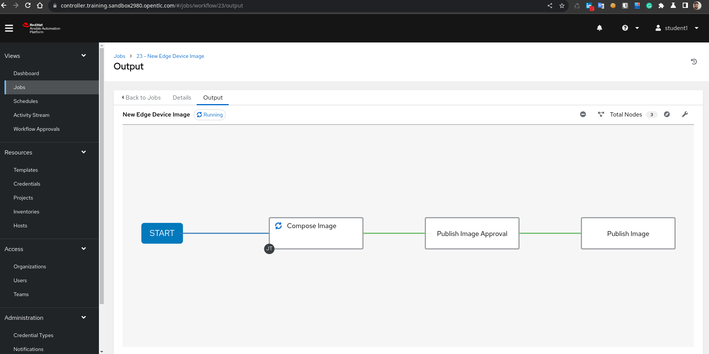
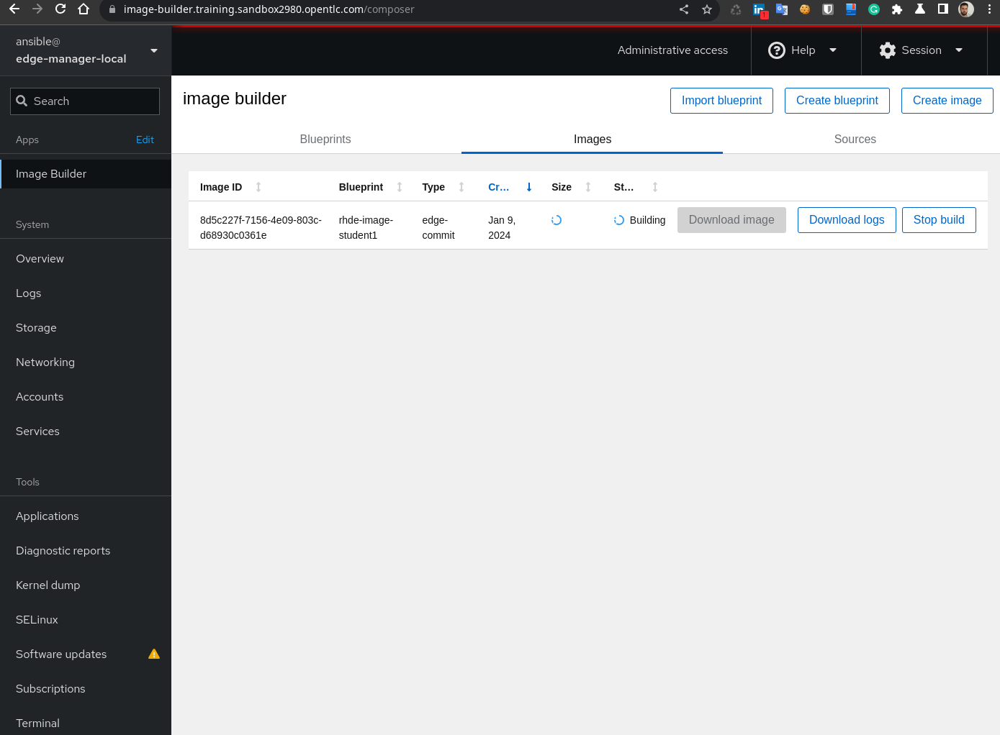

# Section 1 - Creating RHEL Images the GitOps way

## Video

[](https://www.youtube.com/watch?v=GBNGv4zVuOY)


---


1. Open Gitea in `http://<edge-management-server-ip>:3000` and use one of the configured users/passwords (by default `user1` to `user3` are created with `password1` to `password3`).

  >**Note**
  >
  > Change those variables with the values that you can find in the `playbook/main.yml` file that you used for the deployment or check the collection defaults to know more about pre-configured variable settings.

You will see two repositories: `aap`, with the AAP ansible playbooks, `rhde`, with the Operating System and APP configurations that we will use in Sections 3 and 4, and also the image descriptors.

Inside `rhde` repository you will find that three directories have been created to host definitions and configurations for different environments (`prod`, `test`, `dev`). During this demo we will be using `prod`.

The Image definitions are under `rhde_image` directory. If you review the `prod` directory, you will find three files:

* `prod-image-definition.yml`: This is the descriptor that will generate the image Blueprint and commit that Blueprint in the Image Builder service to generate the new Red Hat Device Edge image. The file is actually the vars for the [Osbuild Composer Ansible Collection](https://github.com/redhat-cop/infra.osbuild).


* `prod-deploy_version.yml`: This is a workaround to save some during Section 5. If you want to know more now about this just take a look at  [TIP: Reducing the demo/workshop time by pre-creating images in advance](s5-system-upgrades.md#tip-reducing-the-demo-time-by-pre-creating-images-in-advance). This is not needed at this moment.


* `prod-kickstart.ks`: In this demo/workshop the onboarding is performed by running post-deployment steps launched by a Kickstart file. FIDO Device Onboarding Specification could be used for a more secure onboarding experience but that's out of the scope of the demo. If you want to play with FDO you can follow the [Secure Edge device onboarding with RHEL and FDO](https://github.com/luisarizmendi/edge-demos/blob/main/demos/rhel-fdo-onboarding/README.md) self-paced workshop or build the [Red Hat Device Edge - FDO Secure Onboarding and the Realtime Kernel](https://github.com/redhat-manufacturing/device-edge-workshops/tree/main/exercises/rhde_fdo_rtk) lab.


2. Open the Gitea repository Settings (top right, under the "fork" number). Then jump into the "Webhooks" section. There you will see that there is a webhook configured that, when pushing changes into the repository, will contact the Event Driven Automation (EDA) service, which will be listening and if certain paramenters are fullfil in its filters, it will lauch Jobs and Workflows directly into Ansible Automation Platform (AAP).


3. Open AAP in `https://<edge-management-server-ip>:8443` and use (for example) `user1` with the `password1` password (if you didn't change the defaults). Navigate to "Jobs" and keep that page visible while performing the step below, so you can see how the Jobs are launched automatically after modifying files in Gitea.


4. Now it's time to modify the files so a new image build is automatically launched right after the push the changes into the Gitea repository. In other Sections of this lab we will be modifying the files directly in Gitea for simplicity, although you can also clone the repository in your laptop and push changes from there. 

  >**Note**
  >
  > This first time we will take this approach (clone the repo in our laptop) because we will need to modify two files (`prod-image-definition.yml` and `prod-kickstart.ks`) to prepare and publish our image. If we were using the Gitea Web to modify the files we will need to do it sequentially (you cannot modify two files and push the changes, you need to modify-push and then modify-push). That would mean that we will activate the " New Edge Device Image" Workflow Job (which involves "Compose Image" and "Publish Image" Jobs as we will see below ) when we modify the `prod-image-definition.yml` and we will trigger again the "Publish Image" Job when we modify the `prod-kickstart.ks` file.

We need to update the image definition, we could, for example, include a new package, let's say `bind-utils`. We just need to clone the repo, update the file and push the changes:

  >**Note**
  >
  > Since we are just modifying a single file, we could also use the Web UI to modify the file instead of cloning and pushing the repo, but the second option is more close to what you would be doing in production.

  >**Note**
  >
  > If you have your Ansible Automation Platform locally (instead on a remote location or public cloud) you should remove the `libreswan` package from your image so the VPN is not configured in the edge device, otherwise you could find connectivity issues trying to access AAP after the first device onboarding.

  >**Note**
  >
  > Now we will just copy the example files. We will review the contents while the image is being generated to fill that time with something useful.

* Clone the repository in your laptop (use same user and password than in Gitea and AAP):

```bash
larizmen@hal9k:/tmp/demo$ git clone http://<edge-management-server-ip>:3000/rhde
Cloning into 'rhde'...
Username for 'http://<edge-management-server-ip>:3000': user1
Password for 'http://<edge-management-server-ip>:3000': 
remote: Enumerating objects: 18, done.
remote: Counting objects: 100% (18/18), done.
remote: Compressing objects: 100% (18/18), done.
remote: Total 18 (delta 10), reused 0 (delta 0), pack-reused 0
Receiving objects: 100% (18/18), 8.79 KiB | 4.39 MiB/s, done.
Resolving deltas: 100% (10/10), done.

```

* Move into the directory and edit the `prod-image-definition.yml` adding `bind-utils` in the `builder_compose_pkgs` section:

```bash
larizmen@hal9k:/tmp/demo$ cd rhde/
larizmen@hal9k:/tmp/demo/rhde$ vi prod/rhde_image/prod-image-definition.yml
```

* Push changes

```bash
larizmen@hal9k:/tmp/demo/rhde$ git add .

larizmen@hal9k:/tmp/demo/rhde$ git commit -m "Adding bind-utils to prod image"
[main 98a20d7] Adding bind-utils to prod image
 2 files changed, 2 insertions(+), 1 deletion(-)

larizmen@hal9k:/tmp/demo/rhde$ git push
Enumerating objects: 7, done.
Counting objects: 100% (7/7), done.
Delta compression using up to 12 threads
Compressing objects: 100% (4/4), done.
Writing objects: 100% (4/4), 359 bytes | 359.00 KiB/s, done.
Total 4 (delta 3), reused 0 (delta 0), pack-reused 0
remote: . Processing 1 references
remote: Processed 1 references in total
To http://<edge-management-server-ip>:3000/user1/rhde
   78573ec..98a20d7  main -> main

```

5. Right after the push, you will see in the AAP Jobs page a new "New Edge Device Image" Workflow and a "Compose Image" Job (which is actually launched by the "New Edge Device Image" Workflow as first step). 

Open the "New Edge Device Image" Workflow and show the following steps:

* "Compose Image": Build the image using the Image Builder service using the values provided in the files that we modified.

* "Publish Image Approval": We introduced an approval step as part of the workflow, so you can create an image without "making it accessible" by the edge devices

* "Publish Image": This will publish the image so the edge devices can use it.


* "Compose Simplified Installer": If there is a file defining a simplified installer ISO in Gitea this step will generate the ISO (you can find an example in [Section 6 - Secure Onboarding with FDO](s6-secure-onboarding-with-fdo.md))

* "Publish Kickstart": If there is any kickstart definition it will be published in the HTTP server

* "Publish Ignition": If there is any [Butane](https://coreos.github.io/butane/) definition it will generate the associated [Ignition](https://coreos.github.io/ignition/) file and this will be published in the HTTP server (you can find an example in [Section 6 - Secure Onboarding with FDO](s6-secure-onboarding-with-fdo.md))





6. Open the Image Builder Cockpit Web console at `https://<edge-management-server-ip>:9090`. Log in with the sudoer user/password that you configured while installing the Edge Management RHEL Operating System. 

You can go to "Image Builder" and click on "Images" so you can see how the new image is being created.



  >**Note**
  >
  > You might need to enable the privilege view (`sudo`) by clicking in "Limited access" lock icon on the top right. You might also need to click on the "Start Socket" and then refresh your Web Browser.


7. Go to Gitea again and review the `prod-kickstart.ks` and `prod-image-definition.yml` that we used to create the image. You can mention this about the files:

For `prod-image-definition.yml`:

* Microshift is enabled in the image. The Microshift package needs the admin to enable two additional repositories. 

```bash
"rhocp-<ocp version>-for-rhel-9-x86-rpms"
"fast-datapath-for-rhel-9-x86-rpms"
```

The Ansible playbooks that installed the lab already enabled these repositories at the Image Builder.

* An administrator user will be created with the defined password (which also could be encrypted instead of provided using plain text). That user will be in the sudoers list

* The image descriptor also enables by default the Systemd unit for Microshift


For `prod-kickstart.ks`:

* The kickstart will launch the OSTree image deployment as you can see in the `ostreesetup` line at the beginning. That line points to where the OSTRee image will be published, in our case `http://<edge-management-server-ip>/user1/prod/repo`

* It will create a configuration file for VPN (if the libreswan package was installed as part of the image). AS part of this config you can see that there is a file containing the secrets...this is a great opportunity to show the benefit of using FIDO FDO instead of Kickstarts for onboarding the devices, since with FDO there will be no secrets delivered to the systems until they are authenticated with an external server (also preventing someone to steal the device and have access to those secrets). 

  >**Note**
  >
  > In order to connect a machine in the local network to the remote node using the already pre-configured VPN, you will need to use a local subnet contained in `192.168.0.0/16` or `172.16.0.0/12`. If you are deploying the edge management server locally and you are using a network in that range, the VPN won't be activated because otherwise there would be routing issues that will prevent you to connect to the edge servers (it's better in that case to deploy the lab with `include_vpn: false` or not including the `libreswan` package in the image definition).

  >**Note**
  >
  > In order to connect a machine in the local network to the remote node you will need to use a local subnet contained in `192.168.0.0/16` or `172.16.0.0/12`

* It creates a script for AAP auto-registration, so the new device is included in the AAP inventory directly without human intervention 


8. You can also mention that two custom RPMs where installed as part of the image definition `inotify-gitops` and `workload-manifest`. Those are hosted in a local repository (you can show the repo in the `Sources` section), and those will configure the custom agent that will monitor changes in `/etc` to trigger workflows in AAP, and also a set of manifests that will be auto-deployed in Microshift. 


9. Probably after the time invested in explaining the files and reviewing the Image Builder Cockpit the new Image is created. 


10. Go to the "Jobs" page in the AAP and click the "New Edge Device Image" workflow. Click the "Publish Image Approval" box and finally click on "Approve" (button left) to let the workflow progress


11. The "Publish Image" Job does not take as long as the image creation.


12. Finally, you can open `http://<edge-management-server-ip>/<user>/prod/` and check the contents that have been published, including the `kickstarts` and the `repos` (which is the OSTree image generated with Image Builder) directories.


